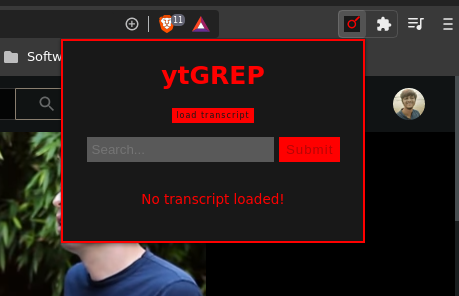
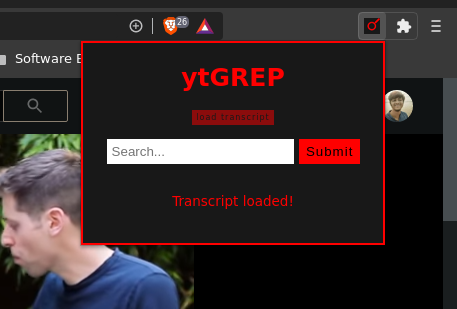
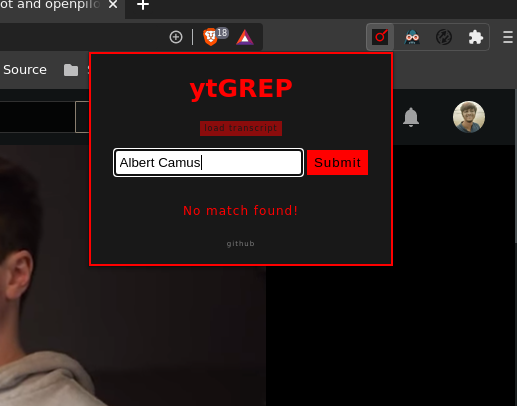

# ytGREP

  
  A simple chrome extension to search for words or sentences used in a youtube video.

## TODO

- Add support for Firefox
- Work on feature requests from users

## How to contribute

- Raise issue for bugs or feature requests [here](https://github.com/sr1jan/ytGREP/issues)
- Submit a [PR](https://github.com/sr1jan/ytGREP/pulls) for collaboration

## Screenshots

- No transcript loaded
  

- Transcript loaded
  

- Match found
  

- No Match found
  
