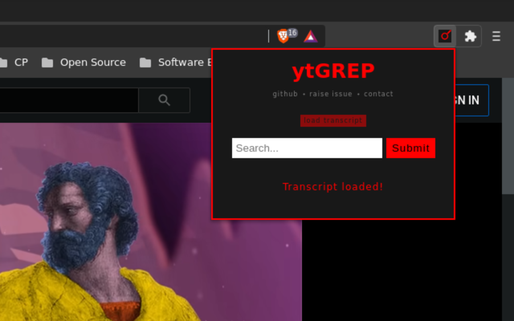

  

A simple chrome extension to search for words or sentences used in a youtube video.

  

     
  

  

     
  

  

     
  

  

    

      
    

  

  

    

      
    

  

## TODO

- Add support for Firefox
- Semantic search
- Work on feature requests from users

## How to contribute

- Raise issue for bugs or feature requests [here](https://github.com/sr1jan/ytGREP/issues)
- Submit a [PR](https://github.com/sr1jan/ytGREP/pulls) for collaboration

## Screenshots

  

 

  

 

  

 

  

 
